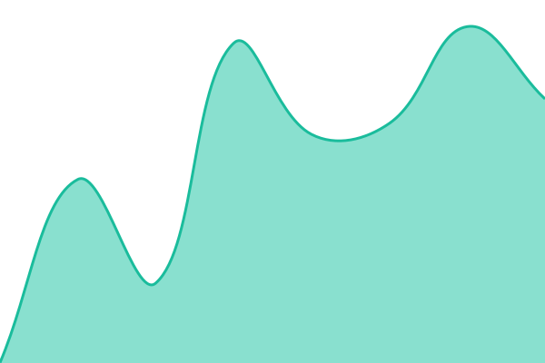

# [📈 Live Status](https://H-edu-dev.github.io/upptime): <!--live status--> **🟨 Degraded performance**

This repository contains the open-source uptime monitor and status page for [H-edu-dev](https://H-edu-dev.github.io/upptime), powered by [Upptime](https://github.com/upptime/upptime).

With [Upptime](https://upptime.js.org), you can get your own unlimited and free uptime monitor and status page, powered entirely by a GitHub repository. We use [Issues](https://github.com/H-edu-dev/upptime/issues) as incident reports, [Actions](https://github.com/H-edu-dev/upptime/actions) as uptime monitors, and [Pages](https://H-edu-dev.github.io/upptime) for the status page.

<!--start: status pages-->
<!-- This summary is generated by Upptime (https://github.com/upptime/upptime) -->
<!-- Do not edit this manually, your changes will be overwritten -->
<!-- prettier-ignore -->
| URL | Status | History | Response Time | Uptime |
| --- | ------ | ------- | ------------- | ------ |
|  [Homepage](https://h-edu.cz) | 🟩 Up | [homepage.yml](https://github.com/H-edu-dev/upptime/commits/HEAD/history/homepage.yml) | 

 3452ms
     
 | 

<a href="https://H-edu-dev.github.io/upptime/history/homepage">99.60%</a>
    

|  [API Next](https://api-next.h-edu.cz/content.api/health) | 🟩 Up | [api-next.yml](https://github.com/H-edu-dev/upptime/commits/HEAD/history/api-next.yml) | 

 924ms
     
 | 

<a href="https://H-edu-dev.github.io/upptime/history/api-next">71.26%</a>
    

|  [API Next - first chapter](https://h-edu.cz/content.api/book/book-a?includeChapterContentParts) | 🟩 Up | [api-next-first-chapter.yml](https://github.com/H-edu-dev/upptime/commits/HEAD/history/api-next-first-chapter.yml) | 

 2980ms
     
 | 

<a href="https://H-edu-dev.github.io/upptime/history/api-next-first-chapter">99.61%</a>
    

|  [API Next - load whole book](https://h-edu.cz/content.api/book/book-a/chaptersContent) | 🟩 Up | [api-next-load-whole-book.yml](https://github.com/H-edu-dev/upptime/commits/HEAD/history/api-next-load-whole-book.yml) | 

 3492ms
     
 | 

<a href="https://H-edu-dev.github.io/upptime/history/api-next-load-whole-book">99.62%</a>
    

|  [API Old](https://api2.h-edu.cz) | 🟩 Up | [api-old.yml](https://github.com/H-edu-dev/upptime/commits/HEAD/history/api-old.yml) | 

 857ms
     
 | 

<a href="https://H-edu-dev.github.io/upptime/history/api-old">71.26%</a>
    

|  [Test Homepage](https://test.h-edu.cz) | 🟨 Degraded | [test-homepage.yml](https://github.com/H-edu-dev/upptime/commits/HEAD/history/test-homepage.yml) | 

 562ms
     
 | 

<a href="https://H-edu-dev.github.io/upptime/history/test-homepage">100.00%</a>
    

|  [Test API Next](https://api-next-test.h-edu.cz/content.api/health) | 🟩 Up | [test-api-next.yml](https://github.com/H-edu-dev/upptime/commits/HEAD/history/test-api-next.yml) | 

 802ms
     
 | 

<a href="https://H-edu-dev.github.io/upptime/history/test-api-next">71.25%</a>
    

|  [Test API Old](https://api2-test.h-edu.cz) | 🟩 Up | [test-api-old.yml](https://github.com/H-edu-dev/upptime/commits/HEAD/history/test-api-old.yml) | 

 734ms
     
 | 

<a href="https://H-edu-dev.github.io/upptime/history/test-api-old">71.25%</a>
    

<!--end: status pages-->

[**Visit our status website →**](https://H-edu-dev.github.io/upptime)

## 📄 License

- Powered by: [Upptime](https://github.com/upptime/upptime)
- Code: [MIT](./LICENSE) © [H-edu-dev](https://H-edu-dev.github.io/upptime)
- Data in the `./history` directory: [Open Database License](https://opendatacommons.org/licenses/odbl/1-0/)
